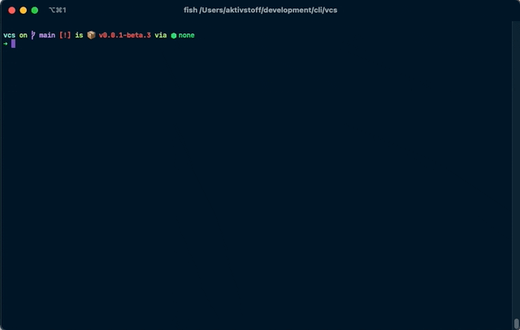

# VC
> A git cli for humans that is pleasent and humble



## Usage
```sh
Usage: vc [options] [command]

A git cli for humans

Options:
  -v --version                      output the current version
  -h, --help                        display help for command

Commands:
  stage                             stage files for commit
  commit [options]                  commit file
  branch [options] [name]           checkout a branch
  history [options] [file]          show the git history
  push [options] [remote] [branch]  push changes to a remote
  merge [branch]
  help [command]                    display help for command
```

## Installation 👩‍🔧

One binary, zero runtime dependencies.

### Download the binary
#### OSX

```sh
curl -L $(curl -s -L https://api.github.com/repos/alexander-heimbuch/vc/releases/latest | grep -o -E "https://(.*)vc(.*)vc-macos") --output /usr/local/bin/vc && chmod +x /usr/local/bin/vc
```

#### Linux

```sh
sudo curl -L $(curl -s -L https://api.github.com/repos/alexander-heimbuch/vc/releases/latest | grep -o -E "https://(.*)vc(.*)vc-linux") --output /usr/local/bin/vc && chmod +x /usr/local/bin/vc
```

### Verify the installation

```sh
vc --version
```

## Motivation 💡

Git is one of the tools that fundamentally influences a developers way to work. It is a key enabler for collaboration, to automate code integration processes or just as a simple safety net while plow through your code base. The backbone of modern development is build on a remarkable cli tool that enabled ecosystems like GitHub or GitLab to rise. 
On a personal level I've always struggled with the git cli. The git version control model itself already introduces a challenge for beginners and is surpassed by the plenty of options the git cli provides. You might already stumbled upon [discussions](https://news.ycombinator.com/item?id=12621955) if the cli is good or bad and in what way it violates [cli design patterns](https://clig.dev/). However like most of you I also have [some aliases](https://stevelosh.com/blog/2013/04/git-koans/) available to simplify my daily doing. But from time to time I wished for a helping hand to support me in staging commits, switching branches or looking at the git history. VC is my approach to encapsulate best practices and covering human intentions to simplify version control.

## Bugs and Issues 🐛

If you encounter any bugs or issues feel free to create an [issue](https://github.com/alexander-heimbuch/vc/issues). Please make sure to search for already resolved issues or related discussions 😇.

## Contribution 📢.
VC is in a very early version and needs your feedback, so please join the [discussion](https://github.com/alexander-heimbuch/vc/discussions)! This cli should be a community effort. The more intel we get around what annoys you with git the better vc will get. If you have an idea or want to contribute on an RFC feel free to add your opinion to the discussion.

## Related cli tools
- https://github.com/jesseduffield/lazygit

## Inspirations & Resources 🔖
- https://www.npmjs.com/package/simple-git
- https://medium.com/@zorrodg/integration-tests-on-node-js-cli-part-1-why-and-how-fa5b1ba552fe
- https://coderwall.com/p/euwpig/a-better-git-log
- https://gitexplorer.com

